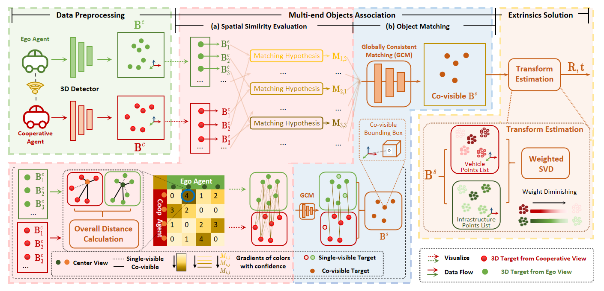
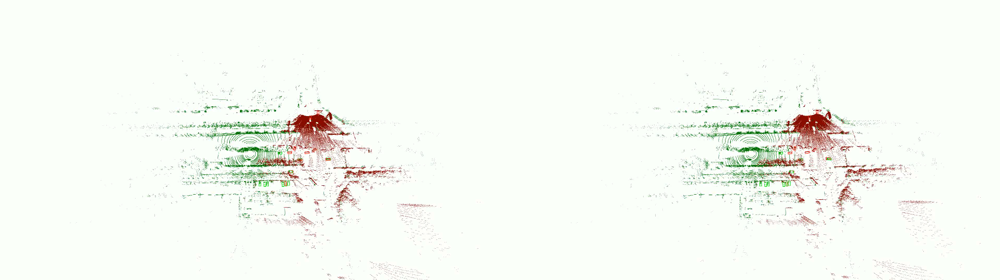

# V2I-CALIB and V2I-CALIB++: Object-Level, Real-Time Point Cloud Global Registration Framework for V2I/V2X Applications

<h3 align="center">
  <a href="https://arxiv.org/abs/2407.10195">V2X-Calib Paper</a> | <a href="https://arxiv.org/abs/2410.11008">V2X-Calib++ Paper</a> 
</h3>

<div align="center">
    
  </div>

<!-- <div style="display: flex; flex-wrap: wrap; gap: 20px; margin-top: 20px;">
  <div style="flex: 1; min-width: 300px;">
    <h3>Calibration Quality Comparison</h3>
    <video controls width="100%" poster="thumbnail_merged.jpg">
      <source src="visuals/merged_output.mp4" type="video/mp4">
      Your browser does not support the video tag. See `visuals/merged_output.mp4`.
    </video>
    <p style="margin-top: 10px; font-size: 0.95rem;">
      This visualization (`visuals/merged_output.mp4`) compares the bounding boxes (obtained via PointPillars on DAIR-V2X) 
      after registration using extrinsic parameters from V2I-Calib++ (left) versus the 
      official DAIR dataset parameters (right). The point cloud overlay demonstrates the 
      improved alignment accuracy achieved by our method.
    </p>
  </div>

</div> -->

[](https://github.com/MassimoQu/v2i-calib/blob/main/visuals/merged_output.mp4)

This visualization (`visuals/merged_output.mp4`) compares the bounding boxes (obtained via PointPillars on DAIR-V2X) after registration using extrinsic parameters from V2I-Calib++ (left) versus the official DAIR dataset parameters (right). The point cloud overlay demonstrates the improved alignment accuracy achieved by our method.

## Highlight

* An initial-value-free online calibration method for vehicle-road multi-end scenarios is proposed, based on perception objects;
* A new multi-end target association method is proposed, which fully explores spatial associations in the scene without positioning priors;
* oIoU and oDist both enable real-time monitoring of external parameters in the scene.


## News
* [2024/09/13] V2I-CALIB++ is available <a href="https://arxiv.org/abs/2410.11008">here</a>.
* [2024/06/30] V2I-CALIB is accepted by IROS 2024!


## Experimental Comparison

We conducted experiments comparing V2I-Calib and V2I-Calib++ against well-performed point cloud Global Registration methods, using two widely recognized V2X datasets: DAIR-V2X and V2X-Sim. The results are as follows.

* <a href="https://github.com/ai4ce/V2X-Sim">V2X-Sim</a> (Synchronous Homologous LiDARs)
    <div align="left">
    <table>
        <tr align="center">
            <td rowspan="2">Method</td>
            <td rowspan="2">RRE(°)</td>
            <td rowspan="2">RTE(m)</td>
            <td colspan="2" align="center">Success Rate(%)</td>
            <td rowspan="2">Time (s)</td>
        </tr>
        <tr align="center">
            <td>@1</td>
            <td>@2</td>
        </tr>
        <tr align="center">
            <td><a href="https://github.com/isl-org/FastGlobalRegistration">FGR</a></td>
            <td>0.69</td>
            <td>0.16</td>
            <td>78.64</td>
            <td>95.15</td>
            <td>0.92</td>
        </tr>
        <tr align="center">
            <td><a href="https://github.com/url-kaist/Quatro">Quatro</a></td>
            <td>0.17</td>
            <td>0.18</td>
            <td>96.40</td>
            <td>98.20</td>
            <td>0.83</td>
        </tr>
        <tr align="center">
            <td><a href="https://github.com/MIT-SPARK/TEASER-plusplus">Teaser++</a></td>
            <td>0.77</td>
            <td>0.17</td>
            <td>76.70</td>
            <td>94.17</td>
            <td>0.91</td>
        </tr>
        <tr align="center">
            <td>V2I-Calib(Ours)</td>
            <td>0.06</td>
            <td>0.03</td>
            <td>93.26</td>
            <td>95.48</td>
            <td>0.37</td>
        </tr>
        <tr align="center">
            <td><strong>V2I-Calib++(Ours)</strong></td>
            <td><strong>0.01</strong></td>
            <td><strong>0.01</strong></td>
            <td><strong>96.80</strong></td>
            <td><strong>98.31</strong></td>
            <td><strong>0.13</strong></td>
        </tr>
    </table>
    </div>
    <h6>* Note: @λ indicates the threshold for success rate</h6>

* <a href="https://github.com/AIR-THU/DAIR-V2X">DAIR-V2X</a> (Asynchronous Heterogeneous LiDARs)
    <div align="left">
    <table>
      <tr align="center">
        <th rowspan="2">Init</th>
        <th rowspan="2">Noise<br>(m & °)</th>
        <th rowspan="2">Method</th>
        <th colspan="3">mRRE (°) ↓</th>
        <th colspan="3">mRTE (m) ↓</th>
        <th colspan="3">SuccessRate (%) ↑</th>
        <th rowspan="2">Time (s) ↓</th>
      </tr>
      <tr align="center">
        <th>@1°</th>
        <th>@2°</th>
        <th>@3°</th>
        <th>@1m</th>
        <th>@2m</th>
        <th>@3m</th>
        <th>@1m</th>
        <th>@2m</th>
        <th>@3m</th>
      </tr>
      <tr align="center">
        <td rowspan="12">✓</td>
        <td>0</td>
        <td><a href="https://www.open3d.org/docs/release/tutorial/pipelines/icp_registration.html">ICP</a></td>
        <td>0.65</td>
        <td>0.98</td>
        <td>1.07</td>
        <td><strong>0.42</strong></td>
        <td><strong>0.54</strong></td>
        <td><strong>0.58</strong></td>
        <td>47.52</td>
        <td>89.55</td>
        <td>96.01</td>
        <td>2.91</td>
      </tr>
      <tr align="center">
        <td>1</td>
        <td><a href="https://www.open3d.org/docs/release/tutorial/pipelines/icp_registration.html">ICP</a></td>
        <td>0.80</td>
        <td>1.36</td>
        <td>1.72</td>
        <td>0.66</td>
        <td>1.31</td>
        <td>1.62</td>
        <td>0.86</td>
        <td>37.93</td>
        <td>80.50</td>
        <td>2.92</td>
      </tr>
      <tr align="center">
        <td>2</td>
        <td><a href="https://www.open3d.org/docs/release/tutorial/pipelines/icp_registration.html">ICP</a></td>
        <td>0.00</td>
        <td>1.48</td>
        <td>2.11</td>
        <td>0.00</td>
        <td>1.33</td>
        <td>2.03</td>
        <td>0.00</td>
        <td>3.66</td>
        <td>19.94</td>
        <td>2.86</td>
      </tr>
      <tr align="center">
        <td>0</td>
        <td><a href="">PICP</a></td>
        <td><strong>0.52</strong></td>
        <td><strong>0.80</strong></td>
        <td><strong>0.88</strong></td>
        <td><strong>0.42</strong></td>
        <td><strong>0.54</strong></td>
        <td><u>0.57</u></td>
        <td><strong>59.59</strong></td>
        <td><strong>90.41</strong></td>
        <td><u>96.12</u></td>
        <td>1.35</td>
      </tr>
      <tr align="center">
        <td>1</td>
        <td><a href="https://www.sciencedirect.com/science/article/pii/S0921889015302712">PICP</a></td>
        <td>0.74</td>
        <td>1.31</td>
        <td>1.67</td>
        <td>0.75</td>
        <td>1.32</td>
        <td>1.63</td>
        <td>2.91</td>
        <td>42.78</td>
        <td>87.93</td>
        <td>1.76</td>
      </tr>
      <tr align="center">
        <td>2</td>
        <td><a href="https://www.sciencedirect.com/science/article/pii/S0921889015302712">PICP</a></td>
        <td>0.80</td>
        <td>1.40</td>
        <td>2.11</td>
        <td>0.53</td>
        <td>1.45</td>
        <td>2.10</td>
        <td>0.22</td>
        <td>2.69</td>
        <td>21.12</td>
        <td>1.70</td>
      </tr>
      <tr align="center">
        <td>0</td>
        <td><a href="https://dl.acm.org/doi/abs/10.1145/3495243.3560539">VIPS</a></td>
        <td>0.63</td>
        <td><u>0.89</u></td>
        <td><u>0.99</u></td>
        <td>0.54</td>
        <td>0.78</td>
        <td>0.89</td>
        <td><u>54.20</u></td>
        <td><u>88.69</u></td>
        <td><strong>97.63</strong></td>
        <td>0.46</td>
      </tr>
      <tr align="center">
        <td>1</td>
        <td><a href="https://dl.acm.org/doi/abs/10.1145/3495243.3560539">VIPS</a></td>
        <td>0.66</td>
        <td>1.04</td>
        <td>1.24</td>
        <td>0.54</td>
        <td>0.82</td>
        <td>1.02</td>
        <td>18.53</td>
        <td>39.01</td>
        <td>47.74</td>
        <td><u>0.44</u></td>
      </tr>
      <tr align="center">
        <td>2</td>
        <td><a href="https://dl.acm.org/doi/abs/10.1145/3495243.3560539">VIPS</a></td>
        <td><u>0.58</u></td>
        <td>1.17</td>
        <td>1.56</td>
        <td><u>0.48</u></td>
        <td>0.96</td>
        <td>1.39</td>
        <td>2.37</td>
        <td>7.87</td>
        <td>13.15</td>
        <td>0.47</td>
      </tr>
      <tr align="center">
        <td>0</td>
        <td><a href="https://ieeexplore.ieee.org/abstract/document/10461035">CBM †</a></td>
        <td>0.61</td>
        <td>0.97</td>
        <td>1.21</td>
        <td>0.53</td>
        <td>0.80</td>
        <td>1.06</td>
        <td>17.11</td>
        <td>23.04</td>
        <td>26.49</td>
        <td><strong>0.35</strong></td>
      </tr>
      <tr align="center">
        <td>1</td>
        <td><a href="https://ieeexplore.ieee.org/abstract/document/10461035">CBM †</a></td>
        <td>0.71</td>
        <td>0.94</td>
        <td>1.14</td>
        <td>0.61</td>
        <td><u>0.74</u></td>
        <td>1.00</td>
        <td>9.91</td>
        <td>15.63</td>
        <td>16.49</td>
        <td>0.36</td>
      </tr>
      <tr align="center">
        <td>2</td>
        <td><a href="https://ieeexplore.ieee.org/abstract/document/10461035">CBM †</a></td>
        <td>0.69</td>
        <td>1.09</td>
        <td>1.38</td>
        <td>0.58</td>
        <td>0.76</td>
        <td>1.06</td>
        <td>6.03</td>
        <td>12.28</td>
        <td>16.81</td>
        <td><strong>0.35</strong></td>
      </tr>
      <tr align="center">
        <td>✕</td>
        <td>-</td>
        <td><a href="https://github.com/isl-org/FastGlobalRegistration">FGR</a></td>
        <td>0.71</td>
        <td>1.15</td>
        <td>1.47</td>
        <td>0.70</td>
        <td>1.13</td>
        <td>1.45</td>
        <td>14.76</td>
        <td>31.57</td>
        <td>35.34</td>
        <td>22.73</td>
      </tr>
      <tr align="center">
        <td>✕</td>
        <td>-</td>
        <td><a href="https://github.com/url-kaist/Quatro">Quatro</a></td>
        <td><strong>0.62</strong></td>
        <td>1.22</td>
        <td>1.46</td>
        <td>0.65</td>
        <td>1.19</td>
        <td>1.51</td>
        <td>12.07</td>
        <td>30.50</td>
        <td>45.04</td>
        <td>21.58</td>
      </tr>
      <tr align="center">
        <td>✕</td>
        <td>-</td>
        <td><a href="https://github.com/MIT-SPARK/TEASER-plusplus">Teaser++</a></td>
        <td>0.69</td>
        <td>1.13</td>
        <td>1.47</td>
        <td>0.66</td>
        <td>1.09</td>
        <td>1.44</td>
        <td>14.33</td>
        <td>29.74</td>
        <td>34.81</td>
        <td><u>22.43</u></td>
      </tr>
      <tr align="center">
        <td>✕</td>
        <td>-</td>
        <td>V2I-Calib</td>
        <td>0.66</td>
        <td><u>1.03</u></td>
        <td><u>1.25</u></td>
        <td>0.54</td>
        <td>0.91</td>
        <td>1.18</td>
        <td>25.54</td>
        <td>55.93</td>
        <td>72.31</td>
        <td>0.21</td>
      </tr>
      <tr align="center">
        <td>✕</td>
        <td>-</td>
        <td>V2I-Calib++<sub>GT</sub><sup>∞</sup></td>
        <td><strong>0.62</strong></td>
        <td><strong>1.01</strong></td>
        <td>1.26</td>
        <td><strong>0.49</strong></td>
        <td><strong>0.83</strong></td>
        <td>1.07</td>
        <td>22.88</td>
        <td>48.03</td>
        <td>61.49</td>
        <td>0.46</td>
      </tr>
      <tr align="center">
        <td>✕</td>
        <td>-</td>
        <td>V2I-Calib++<sub>GT</sub><sup>25</sup></td>
        <td><u>0.63</u></td>
        <td><strong>1.01</strong></td>
        <td><strong>1.23</strong></td>
        <td><u>0.52</u></td>
        <td><u>0.85</u></td>
        <td><strong>1.05</strong></td>
        <td><strong>32.27</strong></td>
        <td><strong>67.59</strong></td>
        <td><strong>82.93</strong></td>
        <td>0.12</td>
      </tr>
      <tr align="center">
        <td>✕</td>
        <td>-</td>
        <td>V2I-Calib++<sub>GT</sub><sup>15</sup></td>
        <td>0.65</td>
        <td>1.05</td>
        <td>1.30</td>
        <td>0.54</td>
        <td>0.87</td>
        <td>1.10</td>
        <td><u>26.79</u></td>
        <td><u>61.17</u></td>
        <td><u>78.75</u></td>
        <td><u>0.09</u></td>
      </tr>
      <tr align="center">
        <td>✕</td>
        <td>-</td>
        <td>V2I-Calib++<sub>GT</sub><sup>10</sup></td>
        <td>0.66</td>
        <td>1.11</td>
        <td>1.36</td>
        <td>0.57</td>
        <td>0.92</td>
        <td>1.15</td>
        <td>20.02</td>
        <td>54.86</td>
        <td>71.98</td>
        <td><strong>0.04</strong></td>
      </tr>
      <tr align="center">
        <td>✕</td>
        <td>-</td>
        <td>V2I-Calib++<sub>PP</sub><sup>15</sup></td>
        <td>0.66</td>
        <td>1.06</td>
        <td>1.29</td>
        <td>0.55</td>
        <td>0.86</td>
        <td>1.07</td>
        <td>24.91</td>
        <td>56.62</td>
        <td>70.94</td>
        <td>-</td>
      </tr>
      <tr align="center">
        <td>✕</td>
        <td>-</td>
        <td>V2I-Calib++<sub>SC</sub><sup>15</sup></td>
        <td>0.65</td>
        <td>1.05</td>
        <td>1.29</td>
        <td>0.54</td>
        <td>0.86</td>
        <td><u>1.06</u></td>
        <td>25.15</td>
        <td>56.89</td>
        <td>71.23</td>
        <td>-</td>
      </tr>
      <tr align="center">
        <td>✕</td>
        <td>-</td>
        <td>V2I-Calib++<sub>GT</sub><sup>25</sup>(hSVD)‡</td>
        <td>0.71</td>
        <td>1.13</td>
        <td>1.35</td>
        <td>0.62</td>
        <td>0.98</td>
        <td>1.25</td>
        <td>21.82</td>
        <td>60.43</td>
        <td>74.92</td>
        <td>0.12</td>
      </tr>
      <tr align="center">
        <td>✕</td>
        <td>-</td>
        <td>V2I-Calib++<sub>GT</sub><sup>25</sup>(mSVD)‡</td>
        <td>0.67</td>
        <td>1.08</td>
        <td>1.31</td>
        <td>0.56</td>
        <td>0.94</td>
        <td>1.19</td>
        <td>25.22</td>
        <td>63.58</td>
        <td>80.22</td>
        <td>0.12</td>
      </tr>
    </table>
    </div>
    <h6>* Note: Comparative Results on the DAIR-V2X Dataset. For the methods that require initial pose values, we add noise of equal magnitude to the rotational and translational dimensions to simulate different levels and sources of noise in real-world scenarios. Lower values are better for <em>mRRE</em> and <em>mRTE</em> ( $\downarrow$), and higher values are better for $SuccessRate$ ($\uparrow$). Subscripts GT, PP, and SC denote ground-truth boxes, PointPillars detector boxes, and SECOND detector boxes, respectively. The superscript k signifies the use of top-k dimension-sorted boxes, while ∞ indicates use all boxes provided. The <strong>best</strong> and <u>second-best</u> results are highlighted in each section.</h6>
    <h6>†: For CBM , our reimplementation (`benchmark/initial_value_method_test.py:255`) achieves comparable accuracy but significantly lower success rates under $ SuccessRate@\lambda $. </h6>
    <h6>‡: V2I-Calib++ entries without parentheses (e.g., V2I-Calib++<sub>GT</sub><sup>25</sup>) use the proposed Weighted SVD (wSVD) by default. Comparisons between wSVD, mSVD, and hSVD strategies (Section 4.4) validate wSVD's superior robustness.</h6>


## Getting Started

### Installation
This code is mainly developed under Ubuntu 20.04. We use anaconda3 with Python 3.8 as the base Python setup.

After cloning this repo, please run:
```
source setup.sh
```

### Minimal Test
To test the sample, simply run the following command:
```
python test.py --test_type single 
```


### Batch Test
For batch testing, additional data preparation is required. This process is also included in the test.py file.

#### Download data and organize as follows

Download DAIR-V2X-C dataset [here](https://thudair.baai.ac.cn/coop-dtest) and organize as follows:

```

# For DAIR-V2X-C Dataset located at ${DAIR-V2X-C_DATASET_ROOT}
├── cooperative-vehicle-infrastructure      # DAIR-V2X-C
    ├── infrastructure-side             # DAIR-V2X-C-I
        ├── velodyne                
            ├── {id}.pcd   
        ├── label	
            ├── camera                  # Labeled data in Infrastructure Virtual LiDAR Coordinate System fitting objects in image based on image frame time
                ├── {id}.json
            ├── virtuallidar            # Labeled data in Infrastructure Virtual LiDAR Coordinate System fitting objects in point cloud based on point cloud frame time
                ├── {id}.json
        ├── data_info.json              # Relevant index information of Infrastructure data
    ├── vehicle-side                    # DAIR-V2X-C-V
        ├── velodyne             
            ├── {id}.pcd
        ├── label	
            ├── camera                  # Labeled data in Vehicle LiDAR Coordinate System fitting objects in image based on image frame time
                ├── {id}.json
            ├── lidar                   # Labeled data in Vehicle LiDAR Coordinate System fitting objects in point cloud based on point cloud frame time
                ├── {id}.json
        ├── data_info.json              # Relevant index information of the Vehicle data
    ├── cooperative                     # Coopetative Files
        ├── label_world                 # Vehicle-Infrastructure Cooperative (VIC) Annotation files
            ├── {id}.json           
        ├── calib
            ├── lidar_i2v               # External Parameters from Infrastructure LiDAR to Vehicle LiDAR
                ├── {id}.json           # Vehicle ID
        ├── data_info.json              # Relevant index information combined the Infrastructure data and the Vehicle data
```

Note: cooperative-vehicle-infrastructure/cooperative/calib/lidar_i2v is generated by `https://github.com/AIR-THU/DAIR-V2X/blob/main/tools/dataset_converter/calib_i2v.py`.

#### Create a symlink to the dataset root
```
cd ${v2i-calib_root}/v2i-calib
mkdir ./data/DAIR-V2X
ln -s ${DAIR-V2X-C_DATASET_ROOT}/cooperative-vehicle-infrastructure ${v2i-calib_root}/v2i-calib/data/DAIR-V2X
```

#### Run Test Command

```
python test.py --test_type batch
```
The results are detailed in `Log/xx.log`. Execute `Log/analyze.py` to analyze the batch test results. The final results will be available in `analysis_results.csv`. You will find these results to be superior to those previously discussed or those presented in the paper :-) 


### Explanation of Key Configuration Parameters

The configuration parameters are located in `config/config.yaml`. To use the oIoU metric, set `core_similarity_component_list = [iou]`. To use the oDist metric, set `core_similarity_component_list = [centerpoint_distance, vertex_distance]`


## Acknowledgment

This project is not possible without the following codebases.
* [DAIR-V2X](https://github.com/AIR-THU/DAIR-V2X)
* [LiDAR-Registration-Benchmark](https://github.com/HKUST-Aerial-Robotics/LiDAR-Registration-Benchmark)


## Citation

If you find our work or this repo useful, please cite:
```
@article{qu2024v2i,
  title={V2I-Calib: A Novel Calibration Approach for Collaborative Vehicle and Infrastructure LiDAR Systems},
  author={Qu, Qianxin and Xiong, Yijin and Wu, Xin and Li, Hanyu and Guo, Shichun},
  journal={arXiv preprint arXiv:2407.10195},
  year={2024}
}
```
```
@article{qu2024v2iplus,
  title={V2I-Calib++: A Multi-terminal Spatial Calibration Approach in Urban Intersections for Collaborative Perception},
  author={Qu, Qianxin and Zhang, Xinyu and Xiong, Yijin and Guo, Shichun and Song, Ziqiang and Li, Jun},
  journal={arXiv preprint arXiv:2410.11008},
  year={2024}
}
```
