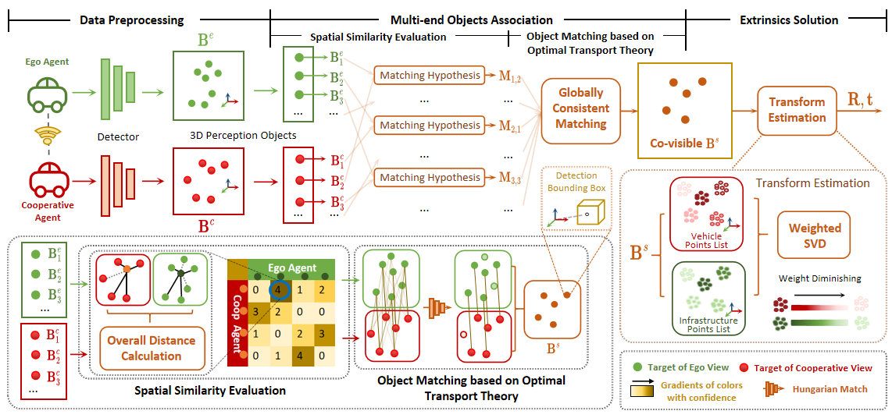

# V2I-CALIB and V2I-CALIB++: Object-Level, Real-Time Point Cloud Global Registration Framework for V2I/V2X Applications

<h3 align="center">
  <a href="https://arxiv.org/abs/2407.10195">V2X-Calib Paper</a> | <a href="https://arxiv.org/abs/2410.11008">V2X-Calib++ Paper</a> 
</h3>

<div align="center">
    
  </div>

## Highlight

* An initial-value-free online calibration method for vehicle-road multi-end scenarios is proposed, based on perception objects;
* A new multi-end target association method is proposed, which fully explores spatial associations in the scene without positioning priors;
* oIoU and oDist both enable real-time monitoring of external parameters in the scene.


## News
* [2024/09/13] V2I-CALIB++ is available <a href="https://arxiv.org/abs/2410.11008">here</a>.
* [2024/06/30] V2I-CALIB is accepted by IROS 2024!

## Experimental Comparison

We conducted experiments comparing V2I-Calib and V2I-Calib++ against well-performed point cloud Global Registration methods, using two widely recognized V2X datasets: DAIR-V2X and V2X-Sim. The results are as follows.

* <a href="https://github.com/ai4ce/V2X-Sim">V2X-Sim</a> (Synchronous Homologous LiDARs)
    <div align="left">
    <table>
        <tr align="center">
            <td rowspan="2">Method</td>
            <td rowspan="2">RRE(°)</td>
            <td rowspan="2">RTE(m)</td>
            <td colspan="2" align="center">Success Rate(%)</td>
            <td rowspan="2">Time (s)</td>
        </tr>
        <tr align="center">
            <td>@1</td>
            <td>@2</td>
        </tr>
        <tr align="center">
            <td><a href="https://github.com/isl-org/FastGlobalRegistration">FGR</a></td>
            <td>0.69</td>
            <td>0.16</td>
            <td>78.64</td>
            <td>95.15</td>
            <td>0.92</td>
        </tr>
        <tr align="center">
            <td><a href="https://github.com/url-kaist/Quatro">Quatro</a></td>
            <td>0.17</td>
            <td>0.18</td>
            <td>96.40</td>
            <td>98.20</td>
            <td>0.83</td>
        </tr>
        <tr align="center">
            <td><a href="https://github.com/MIT-SPARK/TEASER-plusplus">Teaser++</a></td>
            <td>0.77</td>
            <td>0.17</td>
            <td>76.70</td>
            <td>94.17</td>
            <td>0.91</td>
        </tr>
        <tr align="center">
            <td>V2I-Calib(Ours)</td>
            <td>0.06</td>
            <td>0.03</td>
            <td>93.26</td>
            <td>95.48</td>
            <td>0.37</td>
        </tr>
        <tr align="center">
            <td><strong>V2I-Calib++(Ours)</strong></td>
            <td><strong>0.01</strong></td>
            <td><strong>0.01</strong></td>
            <td><strong>96.80</strong></td>
            <td><strong>98.31</strong></td>
            <td><strong>0.13</strong></td>
        </tr>
    </table>
    </div>
    <h6>* Note: @λ indicates the threshold for success rate</h6>
* <a href="https://github.com/AIR-THU/DAIR-V2X">DAIR-V2X</a> (Asynchronous Heterogeneous LiDARs)
    <div align="left">
    <table>
        <tr align="center">
            <td rowspan="2">Method</td>
            <td rowspan="2">RRE(°)</td>
            <td rowspan="2">RTE(m)</td>
            <td colspan="2" align="center">Success Rate(%)</td>
            <td rowspan="2">Time (s)</td>
        </tr>
        <tr align="center">
            <td>@1</td>
            <td>@2</td>
        </tr>
        <tr align="center">
            <td><a href="https://github.com/isl-org/FastGlobalRegistration">FGR</a> </td>
            <td>1.71</td>
            <td>1.61</td>
            <td>22.11</td>
            <td>62.81</td>
            <td>25.50</td>
        </tr>
        <tr align="center">
            <td><a href="https://github.com/url-kaist/Quatro">Quatro</a></td>
            <td>1.46</td>
            <td>1.49</td>
            <td>19.90</td>
            <td>69.90</td>
            <td>24.52</td>
        </tr>
        <tr align="center">
            <td><a href="https://github.com/MIT-SPARK/TEASER-plusplus">Teaser++</a></td>
            <td>1.83</td>
            <td>1.67</td>
            <td>20.30</td>
            <td>58.91</td>
            <td>24.33</td>
        </tr>
        <tr align="center">
            <td>V2I-Calib(Ours)</td>
            <td>1.25</td>
            <td>1.32</td>
            <td>42.81</td>
            <td>76.04</td>
            <td>0.34</td>
        </tr>
        <tr align="center">
            <td><strong>V2I-Calib++(Ours)</strong></td>
            <td><strong>1.23</strong></td>
            <td><strong>1.16</strong></td>
            <td><strong>51.40</strong></td>
            <td><strong>84.58</strong></td>
            <td><strong>0.12</strong></td>
        </tr>
    </table>
    </div>
    <h6>* Note: @λ indicates the threshold for success rate</h6>


## Getting Started

### Installation
This code is mainly developed under Ubuntu 20.04. We use anaconda3 with Python 3.8 as the base Python setup.

After cloning this repo, please run:
```
source setup.sh
```

### Minimal Test
To test the sample, simply run the following command:
```
python test.py --test-type single 
```


### Data Preparation
For batch testing, additional data preparation is required. This process is also included in the test.py file.

#### Download data and organize as follows

Download DAIR-V2X-C dataset [here](https://thudair.baai.ac.cn/coop-dtest) and organize as follows:

```

# For DAIR-V2X-C Dataset located at ${DAIR-V2X-C_DATASET_ROOT}
├── cooperative-vehicle-infrastructure      # DAIR-V2X-C
    ├── infrastructure-side             # DAIR-V2X-C-I
        ├── velodyne                
            ├── {id}.pcd   
        ├── label	
            ├── camera                  # Labeled data in Infrastructure Virtual LiDAR Coordinate System fitting objects in image based on image frame time
                ├── {id}.json
            ├── virtuallidar            # Labeled data in Infrastructure Virtual LiDAR Coordinate System fitting objects in point cloud based on point cloud frame time
                ├── {id}.json
        ├── data_info.json              # Relevant index information of Infrastructure data
    ├── vehicle-side                    # DAIR-V2X-C-V
        ├── velodyne             
            ├── {id}.pcd
        ├── label	
            ├── camera                  # Labeled data in Vehicle LiDAR Coordinate System fitting objects in image based on image frame time
                ├── {id}.json
            ├── lidar                   # Labeled data in Vehicle LiDAR Coordinate System fitting objects in point cloud based on point cloud frame time
                ├── {id}.json
        ├── data_info.json              # Relevant index information of the Vehicle data
    ├── cooperative                     # Coopetative Files
        ├── label_world                 # Vehicle-Infrastructure Cooperative (VIC) Annotation files
            ├── {id}.json           
        ├── calib
            ├── lidar_i2v               # External Parameters from Infrastructure LiDAR to Vehicle LiDAR
                ├── {id}.json           # Vehicle ID
        ├── data_info.json              # Relevant index information combined the Infrastructure data and the Vehicle data
```

Note: cooperative-vehicle-infrastructure/cooperative/calib/lidar_i2v is generated by `https://github.com/AIR-THU/DAIR-V2X/blob/main/tools/dataset_converter/calib_i2v.py`.

#### Create a symlink to the dataset root
```
cd ${v2i-calib_root}/v2i-calib
mkdir ./data/DAIR-V2X
ln -s ${DAIR-V2X-C_DATASET_ROOT}/cooperative-vehicle-infrastructure ${v2i-calib_root}/v2i-calib/data/DAIR-V2X
```

#### Batch Test
```
python test.py --test-type batch
```


## Acknowledgment

This project is not possible without the following codebases.
* [DAIR-V2X](https://github.com/AIR-THU/DAIR-V2X)
* [LiDAR-Registration-Benchmark](https://github.com/HKUST-Aerial-Robotics/LiDAR-Registration-Benchmark)


## Citation

If you find our work or this repo useful, please cite:
```
@article{qu2024v2i,
  title={V2I-Calib: A Novel Calibration Approach for Collaborative Vehicle and Infrastructure LiDAR Systems},
  author={Qu, Qianxin and Xiong, Yijin and Wu, Xin and Li, Hanyu and Guo, Shichun},
  journal={arXiv preprint arXiv:2407.10195},
  year={2024}
}
```
```
@article{qu2024v2iplus,
  title={V2I-Calib++: A Multi-terminal Spatial Calibration Approach in Urban Intersections for Collaborative Perception},
  author={Qianxin Qu and Xinyu Zhang and Yijin Xiong and Shichun Guo and Ziqiang Song and Jun Li},
  journal={arXiv preprint arXiv:2410.11008},
  year={2024}
}
```
