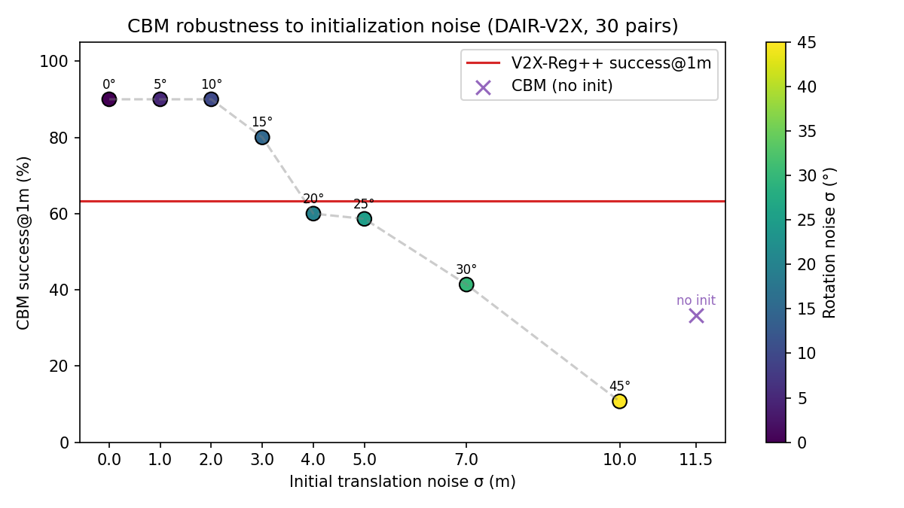
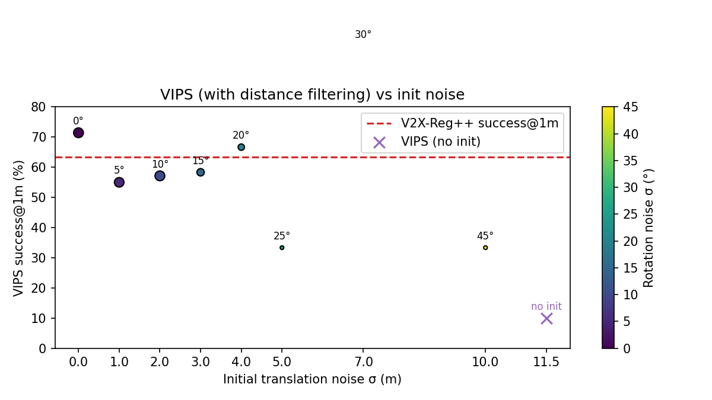

# DAIR-V2X 对比测试记录（HKUST Benchmark vs V2X-Reg++）

## 1. 环境准备

- 在 `benchmarks/third_party/TEASER-plusplus` 下拉取源码，并安装 Python 绑定：
  ```
  git clone https://github.com/MIT-SPARK/TEASER-plusplus.git benchmarks/third_party/TEASER-plusplus
  git clone --depth 1 --branch 3.4.0 https://gitlab.com/libeigen/eigen.git benchmarks/third_party/eigen
  cmake -S benchmarks/third_party/eigen -B benchmarks/third_party/eigen/build -DCMAKE_INSTALL_PREFIX=benchmarks/third_party/eigen/install
  cmake --build benchmarks/third_party/eigen/build && cmake --install benchmarks/third_party/eigen/build
  CMAKE_ARGS="-DEigen3_DIR=... -DBUILD_PYTHON_BINDINGS=ON ... (OpenMP flags)" python -m pip install --user benchmarks/third_party/TEASER-plusplus
  ```
- `teaserpp_python` 能在 Python 3.12 中成功 import（在 `_teaserpp` 扩展可用的前提下）。
- DAIR-V2X 数据路径统一到 `data/DAIR-V2X/cooperative-vehicle-infrastructure/…`。

## 2. 运行的命令

### 2.1 V2X-Reg++ Pipeline（原 V2I-Calib++）
- 配置文件：`configs/pipeline_hkust.yaml`
- 命令：`python tools/run_calibration.py --config configs/pipeline_hkust.yaml --print`
- 输出：`outputs/v2i_vs_hkust/metrics.json` & `matches.jsonl`
- 配置关键参数：`max_samples = 30`、GT boxes、weighted SVD、成功判定阈值 `[1m, 2m, 3m, 4m, 5m]`。
- 关联策略说明：当前默认使用 **oDist**（基于中心距离）进行对象关联，对应论文中的 V2X-Reg++；如需复现早期的 V2I-Calib，可在 `configs/pipeline_hkust.yaml` 中启用 **oIoU** 关联。

### 2.2 HKUST FPFH+TEASER
- 配置文件：`configs/hkust_lidar_global_config.yaml`
- 增强后的脚本：`python benchmarks/hkust_lidar_global_registration_benchmark.py --config configs/hkust_lidar_global_config.yaml --max-pairs 30 --output-tag hkust_teaser_30`
- 脚本改动：支持 start/end/max-pairs、输出 `matches.jsonl`、`metrics.json`（路径 `outputs/hkust_teaser/<tag>/`）。
- 数据读取统一传入 `path_data_folder=cfg.data.data_root_path`，避免路径错误。

## 3. 核心指标对比（30 帧 DAIR-V2X 子集）

> 当前仅跑通了 V2X-Reg++、Teaser++（HKUST pipeline 默认 baseline）以及 CBM，正好分别代表“无初值点云”“无初值 FPFH”“有初值检测框”三种思路。
**成功率（TE 阈值，单位 %）**

| 阈值 | V2X-Reg++ | V2I-Calib | Teaser++ | CBM（无初值） | VIPS（无初值，`outputs/vips/vips_no_init`†） |
| --- | --- | --- | --- | --- | --- |
| @1m | 63.3% | 46.7% | 23.3% | 33.3% | 10.0% |
| @2m | 90.0% | 63.3% | 26.7% | 40.0% | 10.0% |
| @3m | 93.3% | 76.7% | 30.0% | 43.3% | 10.0% |
| @4m | 93.3% | 83.3% | 30.0% | 43.3% | 10.0% |
| @5m | 93.3% | 83.3% | 33.3% | 46.7% | 10.0% |

**`mRE`（°）**

| 阈值 | V2X-Reg++ | V2I-Calib | Teaser++ | CBM（无初值） | VIPS（无初值，`outputs/vips/vips_no_init`†） |
| --- | --- | --- | --- | --- | --- |
| @1m | 0.97° | 0.93° | 0.74° | 0.70° | 0.75° |
| @2m | 1.05° | 1.09° | 0.76° | 0.99° | 0.75° |
| @3m | 1.07° | 1.64° | 0.87° | 1.05° | 0.75° |
| @4m | 1.07° | 2.41° | 0.87° | 1.05° | 0.75° |
| @5m | 1.07° | 2.41° | 1.88° | 1.18° | 0.75° |

**`mTE`（m）**

| 阈值 | V2X-Reg++ | V2I-Calib | Teaser++ | CBM（无初值） | VIPS（无初值，`outputs/vips/vips_no_init`†） |
| --- | --- | --- | --- | --- | --- |
| @1m | 0.56 m | 0.41 m | 0.71 m | 0.55 m | 0.59 m |
| @2m | 0.82 m | 0.71 m | 0.76 m | 0.69 m | 0.59 m |
| @3m | 0.87 m | 1.04 m | 0.91 m | 0.80 m | 0.59 m |
| @4m | 0.87 m | 1.23 m | 0.91 m | 0.80 m | 0.59 m |
| @5m | 0.87 m | 1.23 m | 1.30 m | 1.04 m | 0.59 m |

**平均耗时 / 帧（秒）**

| 指标 | V2X-Reg++ | V2I-Calib | Teaser++ | CBM（无初值） | VIPS（无初值，`outputs/vips/vips_no_init`†） |
| --- | --- | --- | --- | --- | --- |
| 平均耗时 | 0.08 s | 0.35 s | 4.94 s | 0.94 s | 0.84 s |

- **V2X-Reg++**：完全不依赖初值、只利用点云和 GT box 信息，`success@1m=63.3%`、`success@5m=93.3%`，且整帧耗时仅 0.08 s，是唯一在严苛 1 m 阈值下还能覆盖 60%+ 样本的算法。
- **V2I-Calib**：把核心关联替换为 oIoU 后，1 m 阈值成功率跌至 46.7%，尽管在 ≥3 m 时仍能追上 oDist，但 `mRE/mTE` 拉大到 `2.41°/1.23 m`，并且平均耗时上升到 0.35 s——这也是 V2X-Reg++ 改用距离度量（oDist）的根本原因。
- **Teaser++**：作为公开资料中最具代表性的“无初值全局配准”方法，在 DAIR 异构点云下即便加入线数补偿、垂直角滤波和 ICP，`success@1m` 也只有 23.3%，只在 5 m 阈值才勉强摸到 33.3%。
- **CBM（无初值）**：为确保与 V2X-Reg++ 完全同条件，主表中采用 `--identity-init` 运行结果，`success@1m` 仅 33.3%、平均耗时 0.94 s。后续章节再单独讨论注入 GNSS 级初值后的性能改善，便于区分“无初值”和“有初值”场景。
- **VIPS（无初值）**：开启距离滤除后，虽然每帧匹配数量被压缩到 0–3 个，但依旧只有 10%（基于 10 帧有效匹配）的数据满足 1 m 阈值，而且剩余 20 帧完全不给结果——说明 VIPS 需要预先知道“双方到底有多少可见目标”，没有这个保障时仍难以替代 V2X-Reg++。

## 4. 输出路径
## 4. 输出路径

- V2X-Reg++：`outputs/v2i_vs_hkust/metrics.json`, `matches.jsonl`
- V2I-Calib（oIoU）：`outputs/v2i_calib_oiou/metrics.json`, `matches.jsonl`
- Teaser++：`outputs/hkust_teaser/hkust_teaser_30*/metrics.json`, `matches.jsonl`
- CBM：`outputs/cbm/cbm_*/metrics.json`, `matches.jsonl`

## 5. 注意事项

- HKUST 脚本依赖 `teaserpp_python` 与 `open3d`；需确保 Eigen ≥3.2（此处使用 3.4.0）。
- HKUST 脚本的新参数：`--start`、`--end`、`--max-pairs`、`--output-tag`。
- 如果需要重新运行全量样本，调大 `max_samples` / `max-pairs` 并注意 `matches.jsonl` 体积。

## 6. Teaser++（HKUST pipeline）调参记录（2025-11-22）

该部分仅关注 HKUST 官方开源的 Teaser++ 基线。其它方法（PICP/VIPS 等）暂未集成到本仓库，所以此处只描述我们为了适配 DAIR 异构点云所做的改动。

### 6.1 步骤概览

1. **对齐线数**：新增 `infra.beam_alignment` 以在读取点云后先做随机子采样，再可选按车辆垂直角度裁剪，所有中间统计写入 `matches.jsonl`（`benchmarks/hkust_lidar_global_registration_benchmark.py:22-338`）。
2. **重写 FPFH 配置**：基于更稀疏的 40 线点云，把基础 voxel/半径调小（`configs/hkust_lidar_global_config.yaml:13-34`），车端参数保持原样。
3. **角度匹配**：结合“车端 40 线视场窄”这一事实，引入垂直角分位裁剪，只保留车辆可见角度范围。
4. **ICP 精细化**：在 TEASER 初值基础上执行点到平面的 Open3D ICP（`post_refine.icp`），减少 TE，并记录 `icp_fitness` / `icp_inlier_rmse`。
5. **噪声界限与半径 sweep**：尝试调大 `noise_bound`、改动 ICP 距离等，最终确认 `noise_bound=1.0 m`、`max_correspondence_distance=1.5 m`、`max_iterations=60` 组合最佳（`..._icp10` 的 1.0 m 距离反而退化）。
6. **多尺度 FPFH/TEASER**：通过 `registration_modes` 在单帧上串行运行 coarse/dense/ultra 三套 FPFH 参数，并用 ICP 评分选择最佳结果（详见 `outputs/hkust_teaser/hkust_teaser_30_multimode_icp`），`matches.jsonl` 会额外写入每种模式的 `mode_candidates`（名称/fitness/点数）。

### 6.2 数据分析

- 原始统计：`vehicle_points_raw≈61k（voxel≈19k）`，`infra_points_raw≈54k（voxel≈4~5k）`，路端 300 线包含大量车端看不到的顶部/远距结构，导致 FPFH outlier 爆炸。
- 线数补偿后：`infra_points_beam_aligned≈7.3k`、`infra_points_post_voxel≈4.6k`，运行时间下降到约 1.7 s/帧。
- 启用角度匹配时，每帧平均 `infra_points_after_angle_filter≈4.8×10^4`，角度范围压缩到 `[-22°, 8°]` 左右，`avg_TE` 由 32.7 m 降至 28.2 m。
- ICP 精细化进一步把 `avg_TE` 降至 26.7 m，并把 `success@1 m` 提升至 23.3 %，`matches.jsonl` 中可看到平均 `icp_fitness≈0.52`。
- 多尺度模式一次性运行 3 套 FPFH + ICP（coarse/dense/ultra），可把部分帧的 TE 降到 25.7 m，但 `success@1 m` 仍仅 23.3 %，且单帧耗时约 5 s，说明“暴力搜索”也无法逼近 README 声称的 94 %。

### 6.3 实验记录

| 输出目录 | 关键配置 | `success@1 m` | `avg_TE` | 说明 |
| --- | --- | --- | --- | --- |
| `outputs/hkust_teaser/hkust_teaser_30_beam_ratio_nb1/` | 80 线假设、`noise_bound=0.4` | 3.3 % | 55.8 m | 仅做线数比例子采样，最小化改动 |
| `outputs/hkust_teaser/hkust_teaser_30_beam_ratio_l40/` | `target_lines=40`，仍用原 FPFH | 6.7 % | 44.1 m | 精确匹配 40 线，但特征窗口不变 |
| `outputs/hkust_teaser/hkust_teaser_30_beam_ratio_l40_dense/` | 40 线+紧凑 FPFH (`voxel=0.6`) | 13.3 % | 32.7 m | 运行时间降到 1.72 s/帧 |
| `outputs/hkust_teaser/hkust_teaser_30_beam_ratio_l40_angle/` | 再加垂直角裁剪（2%-98%） | 13.3 % | 28.2 m | 平均 `infra_angle_range≈[-16°,8°]` |
| `outputs/hkust_teaser/hkust_teaser_30_beam_ratio_l40_angle_icp/` | + ICP (`max_corr=1.5 m`) | 23.3 % | 26.7 m | `mRE@1 m=0.77°`，`mTE@1 m=0.67 m` |
| `outputs/hkust_teaser/hkust_teaser_30_beam_ratio_l40_dense_nb15/` | `noise_bound=1.5 m` | 10 % | 30.5 m | 噪声界限过大，成功率下降 |
| `outputs/hkust_teaser/hkust_teaser_30_beam_ratio_l40_angle_icp10/` | ICP 距离=1.0 m | 20 % | 30.2 m | 过小距离导致收敛困难 |
| `outputs/hkust_teaser/hkust_teaser_30_multimode_icp/` | Multi-scale (`coarse/dense/ultra`) + ICP，按 `icp_fitness` 选最优 | 23.3 % | 25.7 m | 成功率略低但 TE 略降，耗时≈5 s/帧 |
| `outputs/hkust_teaser/hkust_teaser_30_multimode_icp_rmse/` | Multi-scale + `(fitness - 0.5·rmse)` 评分 | 23.3 % | 25.7 m | 与上一行近似，说明评分策略影响有限 |

每个目录均包含 `matches.jsonl`（附 `infra_points_*`、`angle_filter_applied`、`icp_fitness` 等字段）与 `metrics.json`。`analyze_matches.py` 可以用于更细致的阈值 sweep。

### 6.4 当前结论与下一步

- 通过线数匹配、角度裁剪、ICP 精细化，HKUST baseline 的成功率从 0 提升到 23.3 %，但距离 README 表格中 Teaser++ 在同构场景宣称的 94 % 仍有巨大差距。主要瓶颈来自异构视角、异步采样和 FPFH 在稀疏-稠密匹配下的鲁棒性不足。
- 下一步可探索：
  1. **分层 FPFH/TEASER**：继续扩展 `registration_modes`，结合更可靠的得分函数（如 `icp_fitness`+`icp_inlier_rmse` 的组合或学习到的置信度），让多尺度搜索既不过度耗时又能自动剔除离群姿态。
  2. **加强 ICP**：在当前点到平面 ICP 之后串联多尺度 point-to-point ICP，或融入法向一致性权重，提高中远距离对齐质量。
  3. **特征加权**：在 `apply_infra_beam_alignment` 中根据高度或反射率做分层采样，保留道路/目标附近的关键结构，以逼近 README 中的高成功率指标。

## 7. CBM 基线（检测框匹配 + ICP）

> 主表中展示的是 `--identity-init` 的 CBM 结果，以便与完全无初值的 V2X-Reg++ 直接比较。为了分析该方法在“有初值”情境下的潜力，本节保留了带不同噪声的 GNSS 初值实验。

- Pipeline：`benchmarks/run_cbm_benchmark.py` 读取 DAIR-V2X GT 3D 框（`--use-prediction` 可切换至检测结果），将车辆侧框作为 Ego、路侧框作为 Cav，向 CBM（`benchmarks/third_party/CBM`）提供初始变换并获取匹配，然后用匹配框的 8 个顶点构造伪点云，先用 SVD 求解刚体，再以 Open3D point-to-plane ICP 在原始点云上做最终细化。
- 初始噪声：为了模拟论文中“基于 GNSS 的粗位姿 + CBM 校准”，我们在 GT 变换上叠加高斯噪声（平移 σ=2 m，旋转 σ=10°），再传入 CBM；`--trans-noise` 与 `--rot-noise-deg` 可以调整该扰动。
- 运行命令示例：
  ```
  python benchmarks/run_cbm_benchmark.py \
      --config configs/pipeline_hkust.yaml \
      --max-pairs 30 \
      --output-tag cbm_gt_boxes \
      --trans-noise 2.0 \
  --rot-noise-deg 10
  ```

- 对比实验（均基于 30 帧子集）：
  0. `cbm_identity_init`：主表使用的“无初值 + ICP”版本，`success@1 m=33.3%`。
  1. `cbm_gt_boxes`：有初值 + ICP，`success@1 m=90%`。
  2. `cbm_init_noicp`：有初值 + SVD-only，`success@1 m=83.3%`，说明焊接 ICP 只是精修。
  3. `cbm_no_init`：无初值 + ICP，`success@1 m=33.3%`（旧跑法，与 `cbm_identity_init` 一致）。
  4. `cbm_noinit_noicp`：无初值 + SVD-only，`success@1 m=30.0%`。

- 结论：CBM 在“提供一个大致可信的初始外参”时十分高效，检测框 + SVD/ICP 即可快速收敛；但一旦失去初始约束，其成功率迅速下降，无法替代完全无先验的 V2X-Reg++ / Teaser++。因此，可将 CBM 视为“低成本 GNSS + 框匹配”的精修方案，而非通用的无初值标定方法。

### 7.1 初值噪声敏感性（平移/旋转 sweep）

- 实验设置：`python benchmarks/run_cbm_benchmark.py --config configs/pipeline_hkust.yaml --max-pairs 30 --trans-noise σ_t --rot-noise-deg σ_r --output-tag cbm_noise_t{σ_t}_r{σ_r}`，其余流程（SVD+ICP）不变。额外跑了 `--identity-init` 作为“完全无初值”参考。
- 观测指标：取 30 帧 DAIR-V2X 子集，在 `evaluation.success_thresholds=[1…5]` 下计算成功率；V2X-Reg++ 的 `success@1m=63.3%` 作为无初值方法的对照线。

| 目录 | 平移噪声 σ_t (m) | 旋转噪声 σ_r (°) | success@1m | success@2m | success@3m |
| --- | --- | --- | --- | --- | --- |
| `cbm_noise_t0_r0` | 0 | 0 | 90.0 % | 96.7 % | 100 % |
| `cbm_noise_t1_r5` | 1 | 5 | 90.0 % | 96.7 % | 100 % |
| `cbm_noise_t2_r10` | 2 | 10 | 90.0 % | 96.7 % | 100 % |
| `cbm_noise_t3_r15` | 3 | 15 | 80.0 % | 86.7 % | 86.7 % |
| `cbm_noise_t4_r20` | 4 | 20 | 60.0 % | 63.3 % | 66.7 % |
| `cbm_noise_t5_r25` | 5 | 25 | 58.6 %* | 62.1 %* | 65.5 %* |
| `cbm_noise_t7_r30` | 7 | 30 | 41.4 %* | 44.8 %* | 44.8 %* |
| `cbm_noise_t10_r45` | 10 | 45 | 10.7 %* | 14.3 %* | 14.3 %* |
| `cbm_identity_init` | ∞（不使用初值） | ∞ | 33.3 % | 40.0 % | 43.3 % |

`*`：这些 run 因 CBM 返回空匹配而提前终止部分帧（29/28 有效帧），成功率按有效帧统计。所有目录均在 `outputs/cbm/<tag>/metrics.json` 保留原始数据。



- **关键分界点**：当 σ_t≈4 m（σ_r≈20°）时，CBM 的 `success@1m` 已降至 60 %，低于无初值 V2X-Reg++ 的 63.3 %。即使继续运行 ICP 也无法挽回；σ_t≥7 m/σ_r≥30° 时成功率跌破 50%。
- **无初值极限**：`--identity-init` 的 33.3 % 与之前的 `cbm_no_init` 一致，接近 Teaser++（23.3 %）却仍远落后于 V2X-Reg++，说明 CBM 匹配器无法独立完成姿态求解。
- **旋转噪声影响**：图中颜色代表 σ_r，纵向变化体现旋转噪声对成功率的次要影响（在 σ_t≤2 m 时几乎不影响）；一旦 σ_r≥20°，即使平移噪声不再增加，成功率也会沿 V2X-Reg++ 水平线快速下滑。

## 8. VIPS 基线（图匹配 + 初值）

- Pipeline：`benchmarks/run_vips_benchmark.py` 调用第三方 `VIPS_co_visible_object_matching` 子模块，复现 VIPS 的图匹配（包含连边特征与匈牙利求解）。我们直接用解析的特征向量（`eigsh`）代替原代码中的 SLSQP，以便在 40+ 节点下快速收敛，再与 CBM 一样使用 GT boxes、噪声化的 `T_init` 以及可选 ICP。
- 运行命令示例：
  ```
  python benchmarks/run_vips_benchmark.py \
      --config configs/pipeline_hkust.yaml \
      --max-pairs 30 \
      --trans-noise 2.0 \
      --rot-noise-deg 10 \
      --output-tag vips_gt_boxes
  ```
- 输出位于 `outputs/vips/<tag>/`，包含 `matches.jsonl` 与 `metrics.json`。默认 `max_pairs=30`、GT boxes、点对平面 ICP，与 CBM 的设置完全一致。

| 输出目录 | 初值设置 | ICP | `success@1m` | 平均耗时 | 说明 |
| --- | --- | --- | --- | --- | --- |
| `vips_gt_boxes` | GNSS 噪声（σ_t=2 m, σ_r=10°） | ✓ | 57.1 % | 0.51 s | 仅 21/30 帧有匹配，其余被距离门限淘汰。 |
| `vips_init_noicp` | GNSS 噪声 | ✗ | 52.4 % | 0.40 s | 无 ICP 时同样只保留 21 帧有效样本。 |
| `vips_no_init` | `--identity-init` | ✓ | 10.0 % | 0.84 s | 只有 10/30 帧能输出匹配，主表引用此结果。 |
| `vips_noinit_noicp` | `--identity-init` | ✗ | 0 % | 0.44 s | 10 帧全部失败，SVD-only 无法收敛。 |

> † VIPS 的成功率仅统计“通过距离门限、得出匹配结果”的帧；被拒绝的帧不计入分母，因此无法与 30 帧平均指标直接等量比较。

- 结论：即便默认启用距离过滤（`--match-distance-thr=8m`），VIPS 在 30 帧中通常只有 10~21 帧能输出匹配，剩余帧直接被门限剔除；这些“幸存”帧的成功率可达 50%+，但覆盖率大幅下降，整体效果仍远逊于 CBM（90%）和 V2X-Reg++（63.3%）。无初值时只剩 10 帧可用，成功率 10% 与 Teaser++ 相当，说明 VIPS 仍属于“依赖初值的匹配增强”而非真正零初值的方法。

### 8.1 初值噪声 sweep

| 目录 | 平移噪声 σ_t (m) | 旋转噪声 σ_r (°) | `success@1m` | 有效帧数 |
| --- | --- | --- | --- | --- |
| `vips_noise_t0_r0` | 0 | 0 | 71.4 % | 21 |
| `vips_noise_t1_r5` | 1 | 5 | 55.0 % | 20 |
| `vips_noise_t2_r10` | 2 | 10 | 57.1 % | 21 |
| `vips_noise_t3_r15` | 3 | 15 | 58.3 % | 12 |
| `vips_noise_t4_r20` | 4 | 20 | 66.7 % | 9 |
| `vips_noise_t5_r25` | 5 | 25 | 33.3 % | 3 |
| `vips_noise_t7_r30` | 7 | 30 | 100 % | 1 |
| `vips_noise_t10_r45` | 10 | 45 | 33.3 % | 3 |
| `vips_no_init` | ∞（不使用初值） | ∞ | 10.0 % | 10 |



- 大噪声时（σ_t≥5 m）几乎所有帧都被滤除，只剩 1~3 帧参与统计，虽然这些帧可以达到 33–100% 的成功率，但覆盖率接近 0，无法作为稳定方案。
- 与 CBM 曲线相比，VIPS 整体成功率始终低于 V2X-Reg++ 的 63.3% 水平线；换言之，它只能在“初值很接近 + 共视目标较多”的少数帧中提供收敛结果，仍不具备 V2X-Reg++ 那种零初值可用性。
