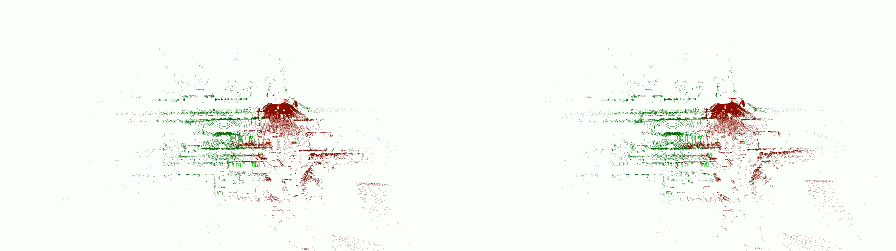

<!-- ## Visualization Results -->

<!-- 

  

    <h3>Calibration Quality Comparison</h3>
    <video controls width="100%" poster="thumbnail_merged.jpg">
      <source src="merged_output.mp4" type="video/mp4">
      Your browser does not support the video tag.
    </video>
    

      This visualization `visuals/merged_output.mp4` compares the bounding boxes (obtained via PointPillars on DAIR-V2X) 
      after registration using extrinsic parameters from V2I-Calib++ (left) versus the 
      official DAIR dataset parameters (right). The point cloud overlay demonstrates the 
      improved alignment accuracy achieved by our method.
    

  

  

    <h3>Latency Scenario Performance</h3>
    <video controls width="100%" poster="thumbnail_delay.jpg">
      <source src="delay_scene.mp4" type="video/mp4">
      Your browser does not support the video tag.
    </video>
    

      (`visuals/delay_scene.mp4`) Extrinsic parameters results from V2I-Calib++ using PointPillars detection boxes under varying latency conditions. We observed an interesting phenomenon: instead of a cliff-like performance decline with increasing latency, the results exhibited complementary trade-offs across different frames. Analysis suggests that at low latency, occlusion-induced detection box invisibility in certain frame pairs adversely affected registration quality. As latency increased, temporal shifting alleviated local occlusion patterns, improving detection in these frames. Concurrently, our method's inherent tolerance to temporal asynchrony enhanced performance in previously suboptimal low-latency scenarios. The visualization highlights our method's robustness in asynchronous real-world conditions.
  

 -->

## Visualization Results

### Calibration Quality Comparison

This visualization (`visuals/merged_output.mp4`) compares the bounding boxes (obtained via PointPillars on DAIR-V2X) after registration using extrinsic parameters from V2I-Calib++ (left) versus the official DAIR dataset parameters (right). The point cloud overlay demonstrates the improved alignment accuracy achieved by our method.

---

### Latency Scenario Performance

(`visuals/delay_scene.mp4`) Extrinsic parameters results from V2I-Calib++ using PointPillars detection boxes under varying latency conditions. We observed an interesting phenomenon: instead of a cliff-like performance decline with increasing latency, the results exhibited complementary trade-offs across different frames. Analysis suggests that at low latency, occlusion-induced detection box invisibility in certain frame pairs adversely affected registration quality. As latency increased, temporal shifting alleviated local occlusion patterns, improving detection in these frames. Concurrently, our method's inherent tolerance to temporal asynchrony enhanced performance in previously suboptimal low-latency scenarios. The visualization highlights our method's robustness in asynchronous real-world conditions.